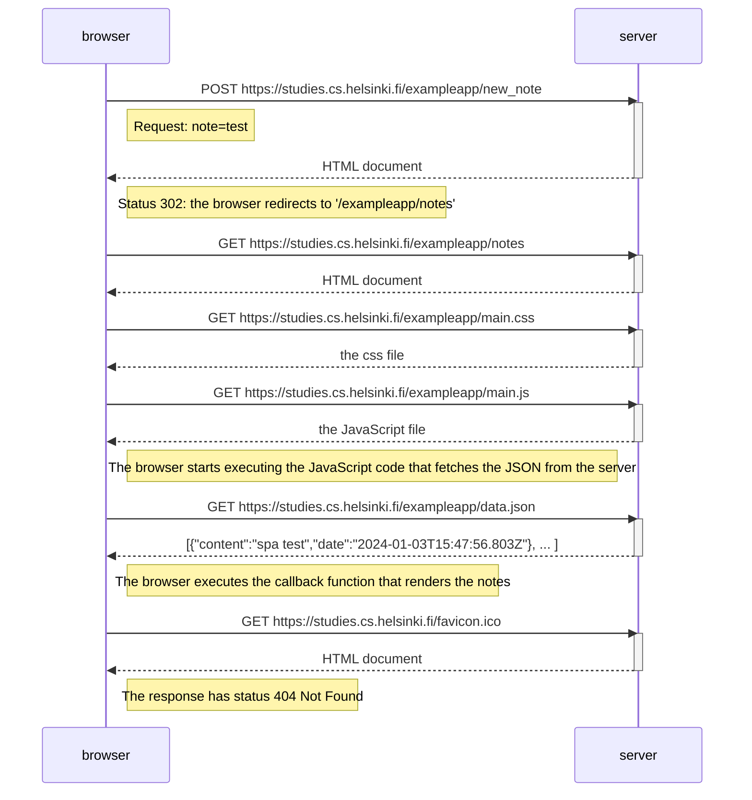

# Exercise 0.4
## Sequence Diagram from https://studies.cs.helsinki.fi/exampleapp/notes

```mermaid
sequenceDiagram
    participant browser
    participant server

    browser->>server: POST https://studies.cs.helsinki.fi/exampleapp/new_note
    activate server
    Note right of browser: Request: note=test
    server-->>browser: HTML document
    deactivate server

    Note right of browser: Status 302: the browser redirects to '/exampleapp/notes'

    browser->>server: GET https://studies.cs.helsinki.fi/exampleapp/notes
    activate server
    server-->>browser: HTML document
    deactivate server

    browser->>server: GET https://studies.cs.helsinki.fi/exampleapp/main.css
    activate server
    server-->>browser: the css file
    deactivate server

    browser->>server: GET https://studies.cs.helsinki.fi/exampleapp/main.js
    activate server
    server-->>browser: the JavaScript file
    deactivate server

    Note right of browser: The browser starts executing the JavaScript code that fetches the JSON from the server

    browser->>server: GET https://studies.cs.helsinki.fi/exampleapp/data.json
    activate server
    server-->>browser: [{"content":"spa test","date":"2024-01-03T15:47:56.803Z"}, ... ]
    deactivate server

    Note right of browser: The browser executes the callback function that renders the notes

    browser->>server: GET https://studies.cs.helsinki.fi/favicon.ico
    activate server
    server-->>browser: HTML document
    deactivate server

    Note right of browser: The response has status 404 Not Found
```