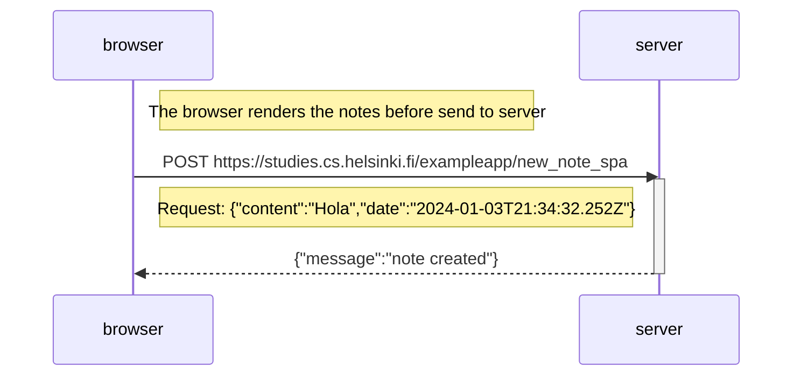

# Exercise 0.6
## Sequence Diagram from https://studies.cs.helsinki.fi/exampleapp/spa

```mermaid
sequenceDiagram
    participant browser
    participant server

    Note right of browser: The browser renders the notes before send to server

    browser->>server: POST https://studies.cs.helsinki.fi/exampleapp/new_note_spa
    activate server
    Note right of browser: Request: {"content":"Hola","date":"2024-01-03T21:34:32.252Z"}
    server-->>browser: {"message":"note created"}
    deactivate server

```